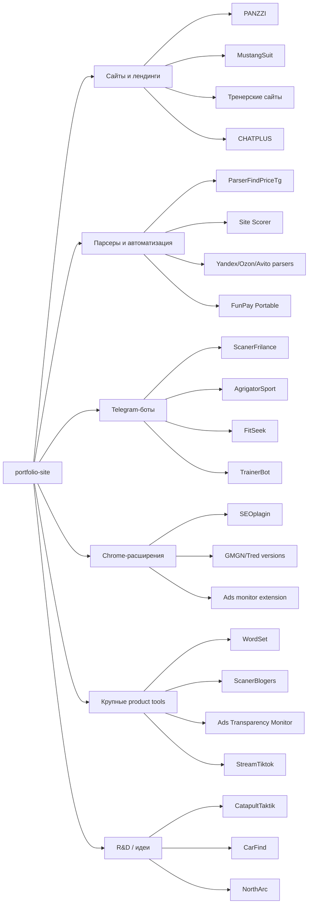

# Карта проектов

Дата ревизии: 2026-06-14.

Источник: локальная папка `E:\Проекты`. При поиске исключались зависимости, кеши, `.git`, `.next`, `node_modules`, виртуальные окружения и внешние research-репозитории. В некоторых папках есть `.env`, базы, логи и локальные данные, поэтому перед публикацией любого кода нужен отдельный секрет-скан.

## Главная витрина

Эти проекты лучше всего показывают опыт и подходят для портфолио.

| Проект | Путь | Что делает | Как работает | Стек | Статус | Что показать |
| --- | --- | --- | --- | --- | --- | --- |
| PANZZI | `E:\Проекты\PANZZI` | Коммерческий сайт магазина мебели и поставок из Китая. | Статический многостраничный сайт: главная, каталог, клиенты, China entry, интерактивные/контентные блоки. | HTML, CSS, JS | Готовый сайт, есть git | Коммерческая верстка, каталог, адаптив, публикация на домене. |
| MustangSuit | `E:\Проекты\законченные\MustangSuit` | Сайт автошколы с заявками и SEO-файлами. | HTML/CSS/JS + `api/`, формы, `.htaccess`, robots, sitemap, privacy/offer pages. | HTML, CSS, JS, PHP | Готовый коммерческий проект | Формы заявок, Telegram/PHP обработка, SEO-подготовка, публикация. |
| KURSOVAI | `E:\Проекты\KURSOVAI` | Система регистрации на курс с пользовательской и админской частью. | React frontend обращается к PHP API, данные хранятся в MySQL, есть SQL init и auth/applications endpoints. | React, Vite, PHP, MySQL, Axios | Учебный fullstack-проект | Fullstack-связка, личный кабинет, админка, заявки, авторизация. |
| SEOplagin / PrivateSEO | `E:\Проекты\SEOplagin` | Chrome/Chromium расширение для SEO-аудита страниц. | Content script собирает DOM/SEO-данные, background делает сетевые проверки, popup показывает вкладки, report формирует PDF. Есть build/zip scripts. | Manifest V3, JS, Chrome APIs, html2pdf | Сильный готовый инструмент | Расширение, SEO checks, report page, PDF, AI proxy architecture. |
| ParserFindPriceTg | `E:\Проекты\frilance\ParserFindPriceTg` | Мониторинг цен по магазинам с Telegram-уведомлениями и web UI. | Парсеры собирают цены, сервисы хранят историю/товары, Telegram отправляет alerts, web API/UI управляет продуктами. | Python, Flask, SQLAlchemy, Selenium, BS4, Telegram API, Google Sheets | Сильный коммерческий/прикладной проект | Автоматизация, парсинг маркетплейсов, Telegram alerts, web-admin, отчеты. |
| ScanerFrilance | `E:\Проекты\тгбот\ScanerFrilance` | Telegram-бот для мониторинга заказов/фриланс-площадок. | `main.py`/`bot.py`, парсеры, storage, фильтры, хэштеги, защита от flood, миграции сообщений. | Python, aiogram, aiohttp, BS4, Playwright | Рабочий бот, есть git | Мониторинг заказов, фильтры, автохэштеги, Telegram workflow. |
| StreamTiktok | `E:\Проекты\StreamTiktok` | MVP аукциона для TikTok LIVE Studio. | DonationAlerts-пожертвования становятся ставками, сервер хранит аукцион в SQLite, React admin управляет лотами, overlay выводится в TikTok LIVE Studio. | Fastify, SQLite, React, TypeScript, Vitest | Сильный MVP | Realtime/overlay, admin panel, auction engine, тесты таймера и ставок. |
| WordSet | `E:\Проекты\WordSet` | DOCX-first checker/fixer для академического оформления. | Python engine парсит DOCX, валидирует по стандарту, планирует safe autofix, web shell дает upload/review/download flow. | Python, DOCX tooling, React/web shell, tests | Очень сильный продуктовый прототип | Работа с документами, валидация стандартов, safe autofix, тесты, реальные fixtures. |
| ScanerBlogers | `E:\Проекты\ScanerBlogers\app` | Система сканирования блогеров/соцсетей и кандидатов. | Next dashboard + worker + Prisma/SQLite, collectors для Instagram/VK/YouTube, расширение, интеграционные/e2e проверки. | Next 16, React 19, Prisma, SQLite, Playwright, Vitest, Python collectors | Крупный production-like инструмент | Архитектура web/worker/core/db, соцсети, очередь, проверки, dashboard. |
| Ads Transparency Monitor | `E:\Проекты\frilance\plagin` | Мониторинг креативов Google Ads Transparency Center. | Next dashboard, worker сканирует advertiser jobs, Prisma/Postgres, Chrome extension exports, deploy scripts. | Next, Prisma, Postgres, worker, Playwright, TS | Сильный коммерческий инструмент | Private dashboard, scan queue, parser verification, deploy pipeline. |
| CHATPLUS | `E:\Проекты\НоваяГлава\CHATPLUS` | Публичный сайт/портал с CMS и AI-контентным workflow. | Astro собирает публичный сайт, Strapi управляет контентом, Postgres/uploads на VPS, scripts/importer/AI generation, pages-preview как legacy snapshot. | Astro, Strapi 5, Postgres, Node scripts, nginx/VPS | Production-проект на VPS | CMS architecture, content workflow, AI draft generation, deploy/rebuild pipeline. |

## Полезные, но требуют отбора или доупаковки

| Проект | Путь | Что делает | Как работает | Стек | Статус | Решение |
| --- | --- | --- | --- | --- | --- | --- |
| FitSeek | `E:\Проекты\тгбот\FitSeek` | Telegram Mini App для поиска тренеров. | FastAPI backend + Telegram bot + React/Vite frontend, туннель для backend, Firebase/webapp URL. | FastAPI, SQLAlchemy, Telegram Bot, React, Vite | Прототип/проект в разработке | Можно показать как mini app, если есть живой demo/screenshot. |
| AgrigatorSport | `E:\Проекты\тгбот\AgrigatorSport` | Telegram-бот генерации тренировок на неделю. | Парсит `trainer.txt`, группирует тренировки, генерирует план, хранит расписание и статистику в БД. | Python, python-telegram-bot, SQLAlchemy | Рабочий бот | Можно объединить с фитнес-направлением или показать как automation bot. |
| TrainerBot | `E:\Проекты\тгбот\TrainerBot` | AI-генератор персональных тренировочных планов. | Core logic + aiogram bot + templates/data + SQLite, запуск через `run.py`. | Python, aiogram, OpenAI, SQLAlchemy, APScheduler | Прототип | Полезно, если отличить от AgrigatorSport и FitSeek. |
| FunPay Portable / vi | `E:\Проекты\vi\funpay_portable` | Автономный инструмент для FunPay trade/sniper alerts. | Backend на Python/FastAPI, frontend, Telegram alerts, локальные расчеты по `data/`. | Python, FastAPI, React/CRA, Telegram | Рабочий локальный инструмент | Хороший automation кейс, но надо аккуратно описать домен. |
| vi dashboard | `E:\Проекты\vi\dashboard` | Dashboard вокруг торговых/маркетплейс данных. | Backend + React frontend, charts через Recharts, API через Axios. | Python, FastAPI, React, Recharts | Неясна готовность | Нужен отдельный запуск/скриншоты. |
| Site Scorer v2 | `E:\Проекты\идеи\site-scorer` | Internal app для ревью сайтов из больших Google Sheets. | Backend/worker берут пачки 50/100/200 строк, Playwright захватывает сайты, frontend дает review-интерфейс и записывает статус обратно. | FastAPI, Postgres, Playwright, React, Vite, shadcn/Tailwind | Сильный внутренний инструмент, лежит в `идеи` | Стоит поднять в статус “проект”, если он рабочий. |
| CatapultTaktik | `E:\Проекты\на будущее\катапульта\CatapultTaktik` | Анализатор паттернов OHLC для токенов Catapult.trade. | Анализирует JSON свечей, ищет входы/выходы, trailing stop, batch-анализ токенов. | Python | R&D/prototype | Можно связать с token audit / trading assistant. |
| CarFind | `E:\Проекты\на будущее\CarFind` | Vite/React проект поиска авто. | Пока выглядит как Vite template с package.json и index. | React, TypeScript, Vite | Черновик | Не в портфолио без доработки. |
| Nura Health scaffold | `E:\Проекты\Проверка способносетй\nura-health-scaffold` | Health/landing scaffold. | Vite React + Tailwind + GSAP + lucide. README шаблонный. | React, Vite, Tailwind, GSAP | Scaffold | Только если есть готовый визуал. |
| Тренерские сайты | `E:\Проекты\тренер\*` | Лендинги персонального тренера. | Статические сайты, разные версии: `MyPlaySuit`, `SuitTrainer`, `ПРАКТИКА/SuitTrainer`. | HTML, CSS, JS | Есть готовые HTML-версии | Выбрать лучшую версию, не показывать все копии. |
| North Arc | `E:\Проекты\идеи\north-arc` | Мини-страница контакта с Telegram CTA. | Статический `index.html` + `styles.css`. | HTML, CSS | Малый прототип | Слишком маленький для отдельного кейса. |

## Архив, копии и технический материал

| Группа | Путь | Что внутри | Что делать |
| --- | --- | --- | --- |
| GMGN plugin versions | `E:\Проекты\плагин для gmgn` | Много копий расширений/версий: `Tred`, `Tre2Win`, `Tred — РАБВАР`, `Tred — ЧИСТАЯ`, вложенный `gmgn-data-server`, `Rug-Killer-On-Solana-main`. | Найти финальную рабочую папку руками. Пока не использовать как один проект: слишком много дублей. |
| АнализаторАудит | `E:\Проекты\АнализаторАудит` | Несколько вариантов `private-seo-audit`, deploy zip, agency site copies. | Считать архивом SEO-аудитора; для портфолио лучше использовать `SEOplagin` или выбрать финальную deploy-ready версию. |
| frilance marketplace_parser | `E:\Проекты\frilance\marketplace_parser` | Парсеры Ozon/Yandex Market, примеры, копии, fake hunter, GUI/API куски. | Выделить один итоговый кейс, не тащить `примеры` и внешние репы. |
| frilance YandexM_parser | `E:\Проекты\frilance\YandexM_parser` | Chrome extension + program/parsers + BAT сценарии авторизации/запуска. | Можно объединить в “marketplace parser automation”. |
| frilance avitoavmatiz | `E:\Проекты\frilance\avitoavmatiz` | Avito automation/extension, old package/manifest, HTML sections. | Проверить финальную версию; потенциальный automation/extension кейс. |
| frilance geo_proxy_checker | `E:\Проекты\frilance\geo_proxy_checker` | Manifest/background/popup, похоже маленькое расширение/утилита. | Малый проект, не в основную витрину. |
| frilance назаказ/webcop | `E:\Проекты\frilance\назаказ\webcop` | HTML/CSS страницы заказных лендингов/постов. | Архив мелких заказов. Можно использовать как “landing pages”, но не отдельными кейсами. |
| тгбот/Ykrast | `E:\Проекты\тгбот\Ykrast` | Pyrogram forwarder. | Слишком малый/служебный проект. |
| мусор | `E:\Проекты\мусор` | BOTF, ParserBotVless, CursorCreatings, forwarder, parser_processes. | Не использовать в портфолио без ручной проверки. Папка сама помечена как мусор. |
| research repos | `ScanerBlogers\research\repos`, `WordSet\research\external`, `катапульта\references` | Внешние библиотеки/исследовательские клоны. | Не считать личными проектами. Можно упоминать как research base, но не как кейсы. |

## Как работает общая экосистема

## Рекомендованная карта для портфолио

### Первый экран / избранное

1. `WordSet` - самый сильный продуктовый кейс: документы, стандарты, автоисправления, тесты.
2. `ScanerBlogers` - крупный fullstack/worker/social scraping кейс.
3. `CHATPLUS` - production CMS/SEO/content workflow.
4. `Ads Transparency Monitor` - private dashboard + worker + deploy.
5. `SEOplagin` - Chrome extension для SEO-аудита.
6. `ParserFindPriceTg` - прикладной parser + Telegram + web UI.

### Второй ряд

7. `StreamTiktok` - TikTok LIVE auction/overlay.
8. `PANZZI` - коммерческий сайт.
9. `MustangSuit` - коммерческий сайт автошколы.
10. `KURSOVAI` - учебный fullstack React/PHP/MySQL.
11. `ScanerFrilance` - Telegram bot monitoring.
12. `Site Scorer` - internal review tool.

### Не показывать как отдельные карточки

- Копии GMGN-плагина до выбора финальной версии.
- `мусор/*`.
- Внешние research/external репозитории.
- Малые шаблонные Vite/CRA scaffold без уникального результата.
- Несколько дублей одного тренерского сайта.

## Риски перед публикацией

- В проектах есть `.env`, локальные БД, токены, server logs, zip deploy artifacts.
- Некоторые README содержат production URLs и deploy details. Для публичного портфолио лучше пересказать, а не копировать полностью.
- Папки `research/repos` и `research/external` содержат чужие репозитории, их нельзя выдавать за свои проекты.
- В `frilance`, `плагин для gmgn`, `АнализаторАудит` много копий: нужна ручная маркировка `final`, `archive`, `draft`.

## Следующий практический шаг

1. Выбрать 10-12 карточек из рекомендованного списка.
2. Для каждой карточки подготовить:
   - короткое описание;
   - стек;
   - роль в проекте;
   - 3 результата/фичи;
   - скриншот или безопасный preview;
   - статус: production / MVP / prototype / archive.
3. Обновить `src/data/site.ts` и карту проектов на сайте.
